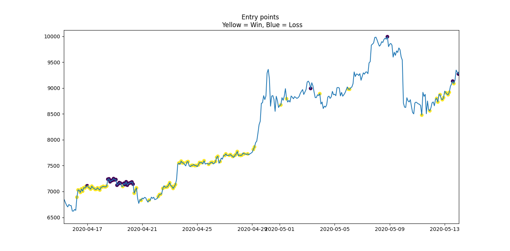

# TBpolo
:information_source: A profitable trading bot using Python and Poloniex API.  
:information_source:In this repository you can find :  
1. Parts of the code
1. A sample of the data that can be used for applying the pipeline on
1. The full report of the project, in <i>pdf</i>

:information_source: Example of the application of the pipeline of 2h BTC_USDT historical data :  

:information_source: A series of articles written related to this pipeline :  
1. I/IV : https://medium.com/analytics-vidhya/i-a-turnkey-python-code-for-creating-a-stock-forecasting-dataset-ad25f673f3b7
1. II/IV : https://medium.com/analytics-vidhya/ii-forecasting-crypto-tendencies-with-deep-learning-in-python-5948909617db
1. III/IV : https://medium.com/analytics-vidhya/iii-creating-profitable-trading-strategies-1858a2fc8b85
1. IV/IV : https://medium.com/analytics-vidhya/iv-deploy-a-poloniex-trading-bot-c3af87eba48c

:information_source: Please report any bug/issue in the *issues* section or directly at sebcararo@hotmail.fr (Any feedback is really appreciated :speech_balloon: :+1:). A :star2: is also greatly appreciated :raised_hands:.  

Just In Case...  
BTC : 3PkoHLXmXsL8kBrFu7GQ8kpmzPBmNK6m8B  
ETH : 0xFdbB5aF291cB7e711D62c1E4a8B58d0EbD423F9C  
